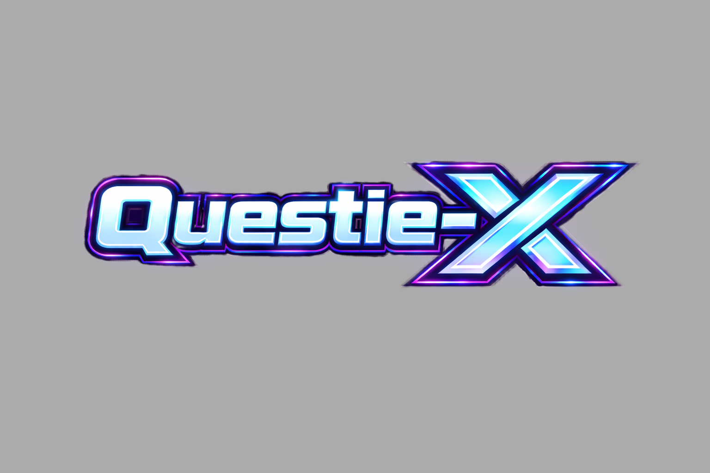

<div align="center">




[](https://xurkon.github.io/Questie-X/)
[](https://www.patreon.com/Xurkon)
[](https://www.paypal.me/Xurkon)


<br/>

**A universal WoW quest-helper with a plugin architecture for any private server.**

[Download Latest](https://github.com/Xurkon/Questie-X/releases/latest) &nbsp;&bull;&nbsp; [View Source](https://github.com/Xurkon/Questie-X) &nbsp;&bull;&nbsp; [Documentation](https://xurkon.github.io/Questie-X/)

</div>

---

## About

Questie-X is a fork of the original [Questie](https://github.com/Questie/Questie) addon, rebuilt to run reliably on any private server regardless of realm type or custom content. It fixes longstanding Lua errors, corrects API incompatibilities introduced by custom server emulators, and introduces a plugin system so server-specific quest databases can be distributed and maintained separately from the core addon.

---

## Installation

Questie-X uses a **two-part install**: the core engine plus one database plugin matching your server.

### Step 1 — Install Questie-X Core

1. [Download](https://github.com/Xurkon/Questie-X/releases/latest) the latest `Questie-X` release `.zip`.
2. Extract the archive — you will get a folder named `Questie-X`.
3. Move that folder into your `Interface/AddOns/` directory:
   ```
   World of Warcraft/
   └── Interface/
       └── AddOns/
           └── Questie-X/          ← place it here
   ```

### Step 2 — Install a Database Plugin

Download and install the plugin for your server from the table below:

| Your Server | Plugin | Repository |
|-------------|--------|------------|
| WotLK 3.3.5 (most private servers) | **Questie-X-WotLKDB** | [Xurkon/Questie-X-WotLKDB](https://github.com/Xurkon/Questie-X-WotLKDB) |
| Classic Era / Vanilla 1.14.x | **Questie-X-ClassicDB** | *(coming soon)* |
| TBC 2.5.x | **Questie-X-TBCDB** | [Xurkon/Questie-X-TBCDB](https://github.com/Xurkon/Questie-X-TBCDB) |
| Turtle WoW | **Questie-X-TurtleDB** | *(coming soon)* |
| Project Ascension | **Questie-X-AscensionDB** | [Xurkon/Questie-X-AscensionDB](https://github.com/Xurkon/Questie-X-AscensionDB) |
| Project Ebonhold | **Questie-X-EbonholdDB** | [Xurkon/Questie-X-EbonholdDB](https://github.com/Xurkon/Questie-X-EbonholdDB) |
| Other / Unknown | Use WotLKDB as a baseline; use `/questie learner` to fill gaps | — |

Extract the plugin zip and drop the folder into `Interface/AddOns/` **alongside** `Questie-X`:

```
Interface/AddOns/
├── Questie-X/                  ← core addon (required)
└── Questie-X-WotLKDB/          ← database plugin (pick one)
```

Log in. If no plugin is detected, Questie-X will print an actionable message in chat telling you exactly which plugin to install.

> **Turtle WoW note:** Enable **"Load out of date AddOns"** on the character select screen if prompted — this is standard practice for all addons on Turtle. Both `Questie-X` and `Questie-X-TurtleDB` target Interface `11200` and will not show this warning once that setting is on.

---

## Plugins

Plugins are separate addons that extend Questie-X with custom quest, NPC, object, and item data for a specific private server. They are distributed as independent downloads and maintained on their own release schedule.

### Available Plugins

| Plugin | Server | Repository |
|--------|--------|------------|
| **Questie-X-WotLKDB** | WotLK 3.3.5 / most private servers | [Xurkon/Questie-X-WotLKDB](https://github.com/Xurkon/Questie-X-WotLKDB) |
| **Questie-X-ClassicDB** | Classic Era / Vanilla 1.14.x | *(coming soon)* |
| **Questie-X-TBCDB** | TBC 2.5.x | [Xurkon/Questie-X-TBCDB](https://github.com/Xurkon/Questie-X-TBCDB) |
| **Questie-X-TurtleDB** | Turtle WoW | *(coming soon)* |
| **Questie-X-AscensionDB** | [Project Ascension](https://ascension.gg) | [Xurkon/Questie-X-AscensionDB](https://github.com/Xurkon/Questie-X-AscensionDB) |
| **Questie-X-EbonholdDB** | [Project Ebonhold](https://ebonhold.com) | [Xurkon/Questie-X-EbonholdDB](https://github.com/Xurkon/Questie-X-EbonholdDB) |

> Don't see your server? See [Writing a Plugin](#writing-a-plugin) to create one, or open an issue to request it.

### Installing a Plugin

See **[Step 2 — Install a Database Plugin](#step-2--install-a-database-plugin)** in the Installation section above.

### Updating a Plugin

Plugins update independently of the core addon. Check the plugin's repository for new releases whenever the server pushes new content patches. The install steps are identical to a fresh install — just overwrite the existing folder.

---

## Plugin System

Questie-X exposes a public `QuestiePluginAPI` that any addon can use to register custom server data without touching core files. This makes it possible to maintain server-specific databases as independent repositories that update on their own release schedule.

### How It Works

A plugin calls `QuestiePluginAPI:RegisterPlugin` during addon load and passes its database tables. Questie-X merges these into its runtime database before the first quest scan, so all features — map pins, tooltips, tracker, arrow — work transparently for custom content.

### Writing a Plugin

A minimal plugin needs a `.toc` file declaring `Questie-X` as a dependency and a loader script. The `.toc` must list `Questie-X` under `## Dependencies` so the WoW client loads it in the correct order.

**`MyServer-QuestieDB.toc`**
```
## Interface: 30300
## Title: MyServer QuestieDB
## Notes: Quest database plugin for MyServer
## Dependencies: Questie-X
## Version: 1.0.0

MyServerLoader.lua
MyServerQuestDB.lua
MyServerNpcDB.lua
MyServerObjectDB.lua
MyServerItemDB.lua
```

**`MyServerLoader.lua`**
```lua
local plugin = QuestiePluginAPI:RegisterPlugin("MyServer")

-- Inject each database type (tables follow the same schema as Questie's built-in DBs)
plugin:InjectDatabase("QUEST",  MyServerQuestDB)
plugin:InjectDatabase("NPC",    MyServerNpcDB)
plugin:InjectDatabase("OBJECT", MyServerObjectDB)
plugin:InjectDatabase("ITEM",   MyServerItemDB)

-- Optional: inject custom zone/map routing tables
plugin:InjectZoneTables(MyServerZoneTables)

-- Optional: inject fallback UiMapData for non-standard boundary maps
plugin:InjectUiMapData(MyServerUiMapData)

-- Always call this last — clears Questie's internal zone/quest caches
-- so freshly injected data is picked up on the next scan
plugin:FinishLoading()
```

The database tables follow the same schema as Questie's built-in databases. See [`Modules/Libs/QuestiePluginAPI.lua`](Modules/Libs/QuestiePluginAPI.lua) for the full API reference.

If your server uses non-standard map data, enable **Options → Advanced → Use WotLK map data** after logging in.

---

## Fixes & Compatibility

### Quest Log & Tracker

- Corrected `GetQuestLogTitle` return value indices to match the client API. The client returns `suggestedGroup` at index 4, shifting `isHeader` to index 5 and `questId` to index 9. Previously, modules were using indices 4/8, causing quest headers to be misidentified and `isDaily` to be assigned the wrong value.
- Removed premature `break` on `nil` title in quest log iteration loops. Quest log slots on private servers can be non-contiguous; the loop now uses a nil guard instead of aborting, preventing silently skipped quests.
- Quest objective counters now update correctly when items are deposited by automated systems that bypass the standard loot frame, using a multi-stage `BAG_UPDATE_DELAYED` strategy.
- Fixed `QuestEventHandler` crash on auto-completing quests caused by a missing `QuestiePlayer` module import.
- Fixed re-accepted repeatable quests not showing objective icons after the second acceptance.

### Map & Minimap

- Fixed `WorldMapFrame` compatibility for servers that render the world map in minimized mode.
- Fixed "ghost icon" bug where completed quest icons remained on the map after turn-in.
- Fixed `RequestMapUpdate` logic that caused completed quest icons to persist across zone transitions.
- Downgraded spurious `[CRITICAL] No AreaId found for UiMapId` log spam to debug level. On some servers, `C_Map.GetBestMapForUnit` returns a continent-level UiMapId for capital cities; the nil return was already handled gracefully but was incorrectly logged as critical.
- Fixed map pins for `killCredit`-type objectives not resolving spawn locations correctly.

### Tooltips

- Fixed `attempt to concatenate nil` error when a quest starter or finisher has no name in the database.
- Added support for `killcredit` and `spell` objective types in `MapIconTooltip`.
- Tooltip now displays if an NPC drops an item that starts a quest.

### Quest Arrow

- Refactored distance calculations and target prioritisation; arrow now correctly filters targets by zone and instance.
- Fixed arrow pointing to previously completed objective locations instead of the current finisher.
- Fixed nil error in `_CollectObjective` when processing incomplete quests.
- Fixed arrow direction for quests that require speaking to an NPC as a prerequisite step.

### Nameplates

- Questie nameplate hooks are skipped when a conflicting nameplate addon is detected, preventing taint and UI errors.

### Databases & Custom IDs

- Full support for large integer NPC, quest, object, and item IDs used by custom server emulators.
- Fixed `ZoneDB` crash when encountering maps with no AreaId mapping (e.g. continent-level maps on Kalimdor).
- Fixed `GetObject` returning nil for Item Finishers misidentified as GameObject Finishers on custom servers.
- Fixed `NPC 30514` (Thorim listen bunny) missing fallback spawn data for Sibling Rivalry turn-in.

---

## Features

### Visual Map Objectives

Quest starters, turn-ins, and all objective types are drawn as icons directly on the minimap and world map.

<div align="center">
  
  
  
</div>

### Quest Tracker

- Tracks quests automatically on acceptance.
- Displays up to 20 quests simultaneously (original limit: 5).
- Left-click opens the quest log; right-click provides focus mode and TomTom arrow integration.
- Headers persist correctly across all session events.

<div align="center">
  
</div>

### Quest Arrow

Directional arrow pointing toward the nearest active objective or quest finisher, with zone and instance awareness.

### My Journey & Quests by Zone

- **Journey Log** — records every quest accepted, completed, and abandoned during a session.
- **Quests by Zone** — lists all available and completed quests in a given zone for completionists.

<div align="center">
  
  
</div>

### Database Search & Configuration

- Search the full Questie database for any NPC, object, or quest by name or ID.
- Extensive options: icon scale, tracking behaviour, nameplate display, tracker layout, and more.

<div align="center">
  
  
</div>

---

## Credits

- **Questie Team** — Original addon developers.
- **Xurkon** — Questie-X fork and ongoing maintenance.
- **[Majed (3majed)](https://github.com/3majed/Questie-335)** — Ascension server dataset.

## License

MIT License — see [LICENSE](LICENSE) for details.
