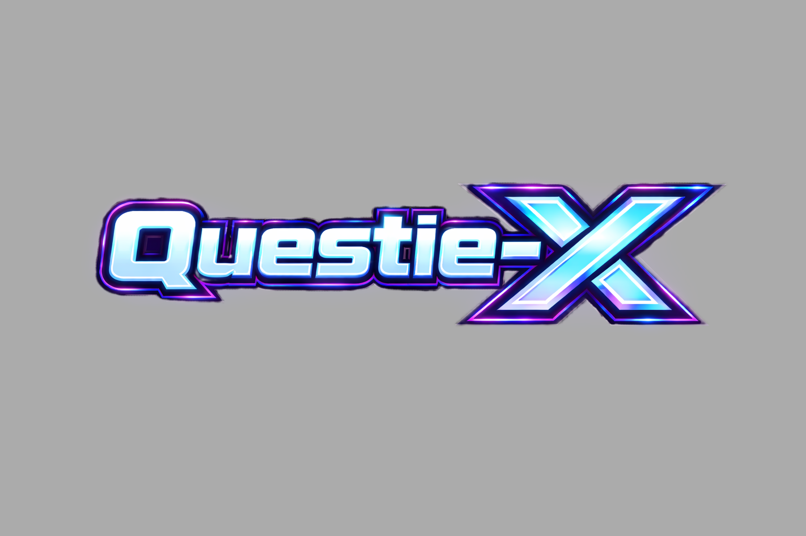

<div align="center">




[](https://github.com/Xurkon/Questie-X/releases)
[](https://xurkon.github.io/Questie-X/)
[](https://www.patreon.com/Xurkon)
[](https://www.paypal.me/Xurkon)


<br/>

**A universal WoW quest-helper with a plugin architecture for any private server.**

[Download Latest](https://github.com/Xurkon/Questie-X/releases/latest) &nbsp;&bull;&nbsp; [View Source](https://github.com/Xurkon/Questie-X) &nbsp;&bull;&nbsp; [Documentation](https://xurkon.github.io/Questie-X/)

</div>

---

## About

Questie-X is a fork of the original [Questie](https://github.com/Questie/Questie) addon, rebuilt to run reliably on any private server regardless of realm type or custom content. It fixes longstanding Lua errors, corrects API incompatibilities introduced by custom server emulators, and introduces a plugin system so server-specific quest databases can be distributed and maintained separately from the core addon.

---

## Installation

> **⚠️ Two addons are always required — even on supported servers**
>
> Questie-X **cannot run alone**. It has no quest, NPC, item, or object data bundled inside it — that data lives entirely in a separate database plugin. You must install **both** the core engine **and** a server-specific database plugin for Questie-X to display anything.
>
> **Which database plugin you need depends on your server** — see the table in Step 2 below.

> **⚠️ Upgrading from the old architecture (Questie-335 / PE-Questie / any pre-v1.1.4 Questie fork)?**
> The old addon loaded its database from files inside the core folder. Questie-X loads data from a separate plugin addon. These two systems are **not compatible** — you must fully remove the old installation before installing Questie-X, or you will get conflicts, duplicate modules, and data errors.
>
> **Before you install:**
> 1. Open `Interface/AddOns/` and **delete** any folder named `Questie`, `Questie-335`, `PE-Questie`, `Questie-X` (if updating), or any other Questie variant.
> 2. Delete any associated saved-variable files: `WTF/Account/<name>/SavedVariables/Questie*.lua`.
> 3. Then follow the fresh install steps below.

### Step 1 — Install Questie-X Core

1. [Download](https://github.com/Xurkon/Questie-X/releases/latest) the latest `Questie-X` release `.zip`.
2. Extract the archive — you will get a folder named `Questie-X`.
3. Move that folder into your `Interface/AddOns/` directory:
   ```
   World of Warcraft/
   └── Interface/
       └── AddOns/
           └── Questie-X/          ← place it here
   ```

### Step 2 — Install Your Server's Database Plugin

> **⚠️ This step is not optional. Questie-X will not work without a database plugin loaded.**

Questie-X **requires** a database plugin to function. The plugin provides quest, NPC, object, and item data specific to your private server. Without it, Questie-X has no data to display.

**Two categories of servers:**

| Your Server Type | What to Install |
|-----------------|----------------|
| **Supported server (see table below)** | Download that server's plugin |
| **Custom/unlisted server** | Use QuestieLearner to crowdsource data; see Note at bottom of this section |

**Download and install the plugin for your server from the table below:**

> **💡 All server plugins also require Questie-X-WotLKDB as the base layer.** Your server-specific plugin (AscensionDB, ClassicDB, etc.) provides the quest data overrides and custom content — but Questie-X-WotLKDB is still needed underneath it for the core WotLK quest data that your server's plugin extends. Install both.

| Your Server | Plugin to Download | Repository |
|-------------|------------------|------------|
| WotLK 3.3.5 (most private servers) | **Questie-X-WotLKDB** | [Xurkon/Questie-X-WotLKDB](https://github.com/Xurkon/Questie-X-WotLKDB) |
| Classic Era / Vanilla 1.14.x | **Questie-X-ClassicDB** | [Xurkon/Questie-X-ClassicDB](https://github.com/Xurkon/Questie-X-ClassicDB) |
| TBC 2.5.x | **Questie-X-TBCDB** | [Xurkon/Questie-X-TBCDB](https://github.com/Xurkon/Questie-X-TBCDB) |
| Project Ascension | **Questie-X-AscensionDB** | [Xurkon/Questie-X-AscensionDB](https://github.com/Xurkon/Questie-X-AscensionDB) |
| Project Ebonhold | **Questie-X-EbonholdDB** | [Xurkon/Questie-X-EbonholdDB](https://github.com/Xurkon/Questie-X-EbonholdDB) |
| Other / Unknown | Use WotLKDB as a starting baseline, then use QuestieLearner to fill gaps | — |

#### How to Install the Plugin

1. Click the repository link for your server in the table above.
2. Go to that repo's **Releases** page.
3. Download the latest release `.zip`.
4. Extract the archive — you will get a folder named `Questie-X-<ServerName>DB` (e.g., `Questie-X-WotLKDB`).
5. Move that folder into your `Interface/AddOns/` directory, **alongside** the `Questie-X` folder you installed in Step 1.

Your final folder structure should look like one of these:

**For WotLK / Classic / TBC servers:**
```
World of Warcraft/
└── Interface/
    └── AddOns/
        ├── Questie-X/              ← Step 1 — core addon (REQUIRED)
        └── Questie-X-WotLKDB/      ← Step 2 — WotLKDB baseline (REQUIRED)
```

**For Ascension servers:**
```
World of Warcraft/
└── Interface/
    └── AddOns/
        ├── Questie-X/              ← Step 1 — core addon (REQUIRED)
        ├── Questie-X-WotLKDB/      ← WotLKDB baseline (REQUIRED)
        └── Questie-X-AscensionDB/  ← AscensionDB overrides (REQUIRED)
```

**For Ebonhold servers:**
```
World of Warcraft/
└── Interface/
    └── AddOns/
        ├── Questie-X/              ← Step 1 — core addon (REQUIRED)
        ├── Questie-X-WotLKDB/      ← WotLKDB baseline (REQUIRED)
        └── Questie-X-EbonholdDB/   ← EbonholdDB overrides (REQUIRED)
```

> **⚠️ Important:** All folders must be present and at the same level inside `Interface/AddOns/`. The server-specific DB (AscensionDB, EbonholdDB, etc.) goes **alongside** `Questie-X-WotLKDB` — it does not replace it. If any folder is missing, Questie-X will show an error message in chat telling you what's missing.

#### After Installation

1. Launch WoW and log in to your character.
2. If Questie-X loads successfully, you will see the minimap icon and no error messages.
3. If no plugin is detected, Questie-X will print a message in chat telling you exactly which plugin to install.

#### Note for Unsupported Servers

If your server is not listed above, install **Questie-X-WotLKDB** as a baseline (it covers general WoW quest data). Then use **QuestieLearner** to record quest and NPC data as you play — gaps will be filled in automatically as you and other players on your server interact with the world. See the [QuestieLearner](#questielearner) section for details.

---

## Writing a Plugin

Questie-X exposes a public `QuestiePluginAPI` that any addon can use to register custom server data without touching core files. This makes it possible to maintain server-specific databases as independent repositories that update on their own release schedule.

### How It Works

A plugin calls `QuestiePluginAPI:RegisterPlugin` during addon load and passes its database tables. Questie-X merges these into its runtime database before the first quest scan, so all features — map pins, tooltips, tracker, arrow — work transparently for custom content.

---

### Plugin Architecture

A minimal plugin needs a `.toc` file declaring `Questie-X` as a dependency and a loader script. The `.toc` must list `Questie-X` under `## Dependencies` so the WoW client loads it in the correct order.

**`MyServer-QuestieDB.toc`**
```
## Interface: 30300
## Title: MyServer QuestieDB
## Notes: Quest database plugin for MyServer
## Dependencies: Questie-X
## Version: 1.0.0

MyServerLoader.lua
MyServerQuestDB.lua
MyServerNpcDB.lua
MyServerObjectDB.lua
MyServerItemDB.lua
```

**`MyServerLoader.lua`**
```lua
local plugin = QuestiePluginAPI:RegisterPlugin("MyServer")

-- Inject each database type (tables follow the same schema as Questie's built-in DBs)
plugin:InjectDatabase("QUEST",  MyServerQuestDB)
plugin:InjectDatabase("NPC",    MyServerNpcDB)
plugin:InjectDatabase("OBJECT", MyServerObjectDB)
plugin:InjectDatabase("ITEM",   MyServerItemDB)

-- Optional: inject custom zone/map routing tables
plugin:InjectZoneTables(MyServerZoneTables)

-- Optional: inject fallback UiMapData for non-standard boundary maps
plugin:InjectUiMapData(MyServerUiMapData)

-- Always call this last — clears Questie's internal zone/quest caches
-- so freshly injected data is picked up on the next scan
plugin:FinishLoading()
```

The database tables follow the same schema as Questie's built-in databases. See [`Modules/Libs/QuestiePluginAPI.lua`](Modules/Libs/QuestiePluginAPI.lua) for the full API reference.

If your server uses non-standard map data, enable **Options → Advanced → Use WotLK map data** after logging in.

---

## Fixes & Compatibility

### Quest Log & Tracker

- Corrected `GetQuestLogTitle` return value indices to match the client API. The client returns `suggestedGroup` at index 4, shifting `isHeader` to index 5 and `questId` to index 9. Previously, modules were using indices 4/8, causing quest headers to be misidentified and `isDaily` to be assigned the wrong value.
- Removed premature `break` on `nil` title in quest log iteration loops. Quest log slots on private servers can be non-contiguous; the loop now uses a nil guard instead of aborting, preventing silently skipped quests.
- Quest objective counters now update correctly when items are deposited by automated systems that bypass the standard loot frame, using a multi-stage `BAG_UPDATE_DELAYED` strategy.
- Fixed `QuestEventHandler` crash on auto-completing quests caused by a missing `QuestiePlayer` module import.
- Fixed re-accepted repeatable quests not showing objective icons after the second acceptance.

### Map & Minimap

- Fixed `WorldMapFrame` compatibility for servers that render the world map in minimized mode.
- Fixed "ghost icon" bug where completed quest icons remained on the map after turn-in.
- Fixed `RequestMapUpdate` logic that caused completed quest icons to persist across zone transitions.
- Downgraded spurious `[CRITICAL] No AreaId found for UiMapId` log spam to debug level. On some servers, `C_Map.GetBestMapForUnit` returns a continent-level UiMapId for capital cities; the nil return was already handled gracefully but was incorrectly logged as critical.
- Fixed map pins for `killCredit`-type objectives not resolving spawn locations correctly.

### Tooltips

- Fixed `attempt to concatenate nil` error when a quest starter or finisher has no name in the database.
- Added support for `killcredit` and `spell` objective types in `MapIconTooltip`.
- Tooltip now displays if an NPC drops an item that starts a quest.
- Fixed `attempt to concatenate local 'minLevel' (a nil value)` crash in `MapIconTooltip` when hovering over creatures whose `creatureLevels` entry was an empty table instead of the expected `{minLevel, maxLevel, rank}` tuple. Added early-return guard in `_GetLevelString`.
- Fixed tooltip crash when hovering over NPC/object keys (`m_<id>`, `o_<id>`) where `learnedNpc[10]` or `learnedObj[10]` is unexpectedly a string instead of a table. Added type guard before iterating the objective list array.

### Quest Arrow

- Refactored distance calculations and target prioritisation; arrow now correctly filters targets by zone and instance.
- Fixed arrow pointing to previously completed objective locations instead of the current finisher.
- Fixed nil error in `_CollectObjective` when processing incomplete quests.
- Fixed arrow direction for quests that require speaking to an NPC as a prerequisite step.
- **Sunstrider Isle (Ascension starting zone)**: Resolved arrow not appearing when the world map is closed. `C_Map.GetBestMapForUnit("player")` returns a ghost/loading map uiMapId (946) instead of Sunstrider Isle's real uiMapId (1241) with the map closed. Added `UiMapIdOverrides` entries for both 946 and 1241 mapping to Sunstrider Isle's areaId (3430). Updated the arrow's `UpdateNearestTargets` fallback to use `ZoneDB` lookups when the ghost map is detected, ensuring the arrow gets real world coordinates regardless of map state.

### Nameplates

- Questie nameplate hooks are skipped when a conflicting nameplate addon is detected, preventing taint and UI errors.

### Databases & Custom IDs

- Full support for large integer NPC, quest, object, and item IDs used by custom server emulators.
- Fixed `ZoneDB` crash when encountering maps with no AreaId mapping (e.g. continent-level maps on Kalimdor).
- Fixed `GetObject` returning nil for Item Finishers misidentified as GameObject Finishers on custom servers.
- Fixed `NPC 30514` (Thorim listen bunny) missing fallback spawn data for Sibling Rivalry turn-in.

---

## QuestieLearner

QuestieLearner is Questie-X's built-in crowdsourced database system. When you interact with the world — accepting quests, killing objectives, looting items, interacting with objects — Questie-X silently records any data it doesn't already have (spawn locations, NPC IDs, item IDs, coordinates). That data is saved locally per-realm and can be shared with other players or submitted back to improve the database for everyone.

This is the primary tool for filling in gaps on **custom or lightly-documented servers** where the base database plugin doesn't have complete coverage.

### What It Learns Automatically

QuestieLearner hooks into several in-game events and records data passively without any user action:

| Event | What is learned |
|-------|----------------|
| Quest accept / turn-in | Quest ID → quest giver/finisher NPC position and ID |
| Kill objective progress | NPC ID → spawn zone and coordinates at time of kill |
| Object interaction | Object ID → spawn zone and coordinates |
| Item loot | Item ID → which NPC/object it dropped from |
| Mouseover | NPC/object name resolved from server for any entity you hover |

Data for quest IDs that exist in the base database is merged into the existing entry. Data for unknown quest IDs (custom server content not yet in the plugin) is stored separately under a per-realm key so it doesn't contaminate the base data.

### Sharing Data with Nearby Players

If other players nearby are also running Questie-X, learned entries are broadcast automatically via the `QUESTIE_LEARNER` addon message channel. You receive their data and they receive yours — no configuration required. This means a group running the same zone will collectively fill in the map faster than any single player could alone.

Received data is validated before merging: entries missing zone ID, coordinates, or NPC name are discarded.

### Exporting Your Data

Once you've accumulated learned data you want to share (e.g. to contribute back to the plugin repository or send to another player), export it from the **Options → Database** tab:

1. Open Questie-X options: `/questie` or click the minimap button → **Options**.
2. Go to the **Database** tab.
3. Click **Export**. A compressed, base64-encoded string is generated and shown in the text box.
4. Copy the entire string (Ctrl+A → Ctrl+C).

The export string encodes your full `QuestieLearnerDB` for the current realm using LibDeflate. It is safe to paste into a Discord message, GitHub issue, or pastebin.

### Importing Data

To load data exported by another player or provided by the community:

1. Open Questie-X options → **Database** tab.
2. Paste the export string into the import text box.
3. Click **Import**. Questie-X decodes and merges the data into your local database and immediately injects it into the active override tables — map pins and tracker entries update without a full reload. A `/reload` is only required if you want newly imported quest starters/finishers to appear on the world map for quests already in your log.

Imported entries follow the same validation rules as received broadcast entries. Conflicts (same NPC ID with different coordinates) are resolved by keeping the entry with the most data fields populated.

### Cleaning Up Stale Data

Over time, the learned database can accumulate entries from old patches, removed NPCs, or incorrect data from unreliable sources. To prune it:

1. Open Questie-X options → **Database** tab.
2. Click **Cleanup**. This removes entries where the NPC/object/item no longer exists in the current loaded database or has coordinates that fall outside any known zone boundary.

### Contributing Learned Data to a Plugin

If you've accumulated significant data for a custom server that doesn't yet have a plugin (or has an incomplete one):

1. Export your data as above.
2. Open an issue or pull request on the relevant plugin repository (e.g. [Questie-X-AscensionDB](https://github.com/Xurkon/Questie-X-AscensionDB)) and paste your export string.
3. The maintainer can decode it with the same Import function and integrate confirmed entries into the next release.

### Slash Commands

| Command | Description |
|---------|-------------|
| `/questie` | Open the options panel (navigate to Database tab) |
| `/ql export` | Print the export string directly to chat for quick copy |
| `/ql import <string>` | Import a data string without opening the options panel |
| `/ql clear` | Clear all learned data for the current realm |
| `/ql status` | Print a summary of how many entries have been learned per data type |

---

## Features

### Visual Map Objectives

Quest starters, turn-ins, and all objective types are drawn as icons directly on the minimap and world map.

<div align="center">
  
  
  
</div>

### Quest Tracker

- Tracks quests automatically on acceptance.
- Displays up to 20 quests simultaneously (original limit: 5).
- Left-click opens the quest log; right-click provides focus mode and TomTom arrow integration.
- Headers persist correctly across all session events.

<div align="center">
  
</div>

### Quest Arrow

Directional arrow pointing toward the nearest active objective or quest finisher, with zone and instance awareness.

### My Journey & Quests by Zone

- **Journey Log** — records every quest accepted, completed, and abandoned during a session.
- **Quests by Zone** — lists all available and completed quests in a given zone for completionists.

<div align="center">
  
  
</div>

### Database Search & Configuration

- Search the full Questie database for any NPC, object, or quest by name or ID.
- Extensive options: icon scale, tracking behaviour, nameplate display, tracker layout, and more.

<div align="center">
  
  
</div>

---

## Credits

- **Questie Team** — Original addon developers.
- **Xurkon** — Questie-X fork and ongoing maintenance.
- **[Majed (3majed)](https://github.com/3majed/Questie-335)** — Ascension server dataset.

## License

MIT License — see [LICENSE](LICENSE) for details.
